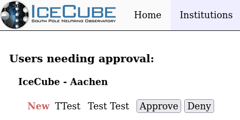
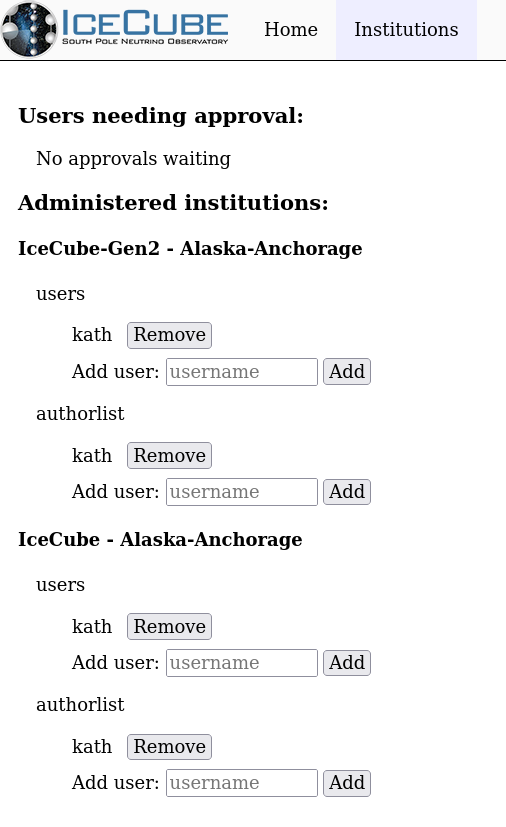

---
hide:
  - toc
---

# Administering Institutions

As an institution administrator, you can approve or deny all user requests
to join your institution, or directly make changes for existing users.

## Registering New Users

New users should register through the [https://user-management.icecube.aq/register](registration page).
It is possible to give out a specific link for an institution, like:

    https://user-management.icecube.aq/register?experiment=IceCube&institution=Aachen

### Manually adding a new user

The only way to manually add a new user is to fill out the registration page
yourself. Then go to the next section on approvals.

## Approving Users

You should get an email whenever a user request needs approval, with
the following link:

[https://user-management.icecube.aq/institutions](https://user-management.icecube.aq/institutions)

The approval page should look like this when there is a request waiting:

You can either approve or deny the request by clicking on the buttons next
to the request.

## Managing Existing Users

You can directly add and remove existing users on the same page:

Remove a user from your institutions with the "Remove" button next to their
username.

Add a new user by entering their username and clicking "Add".
