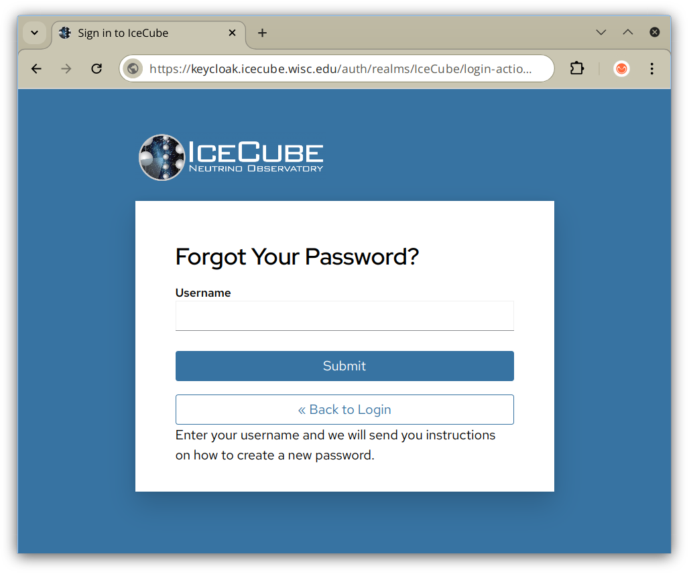
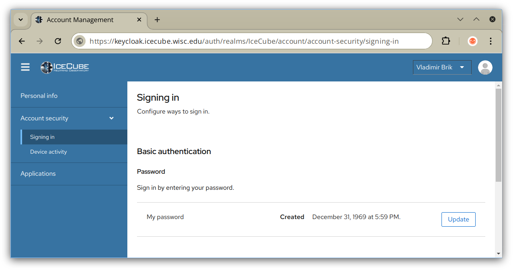
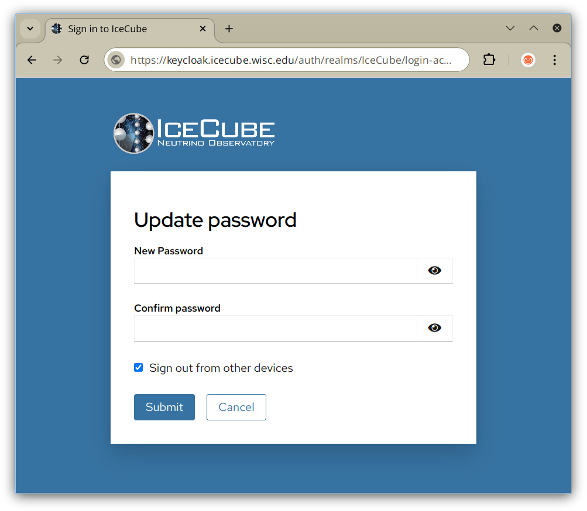

---
hide:
  - toc
---

# Password Reset

Users that do not remember their password and need to reset it can use
the automated "Forgot password?" link on the [login](user_login.md) page.
The "Forgot Your Password?" page looks like:

This will send an email to your external email account with a reset link
that is valid for a few minutes, so you should click on that link quickly.

## Password Change

If you know your existing password but want to change it, go to the
[Keycloak account security page](https://keycloak.icecube.wisc.edu/auth/realms/IceCube/account/#/account-security/signing-in)
It looks like the following:

Click on "Update". You will see the password change form:

