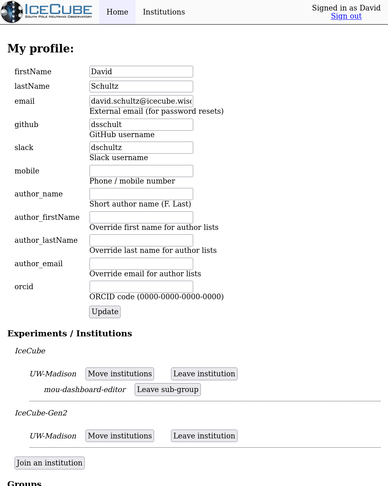

---
hide:
  - toc
---

# User Profile

Basic information about a user, such as their name and external email address,
can be edited by going to your profile in the
[User Management](user-management.icecube.aq/) web application.
Institution and group information is available at the same link.

Here is an example of the profile page:

